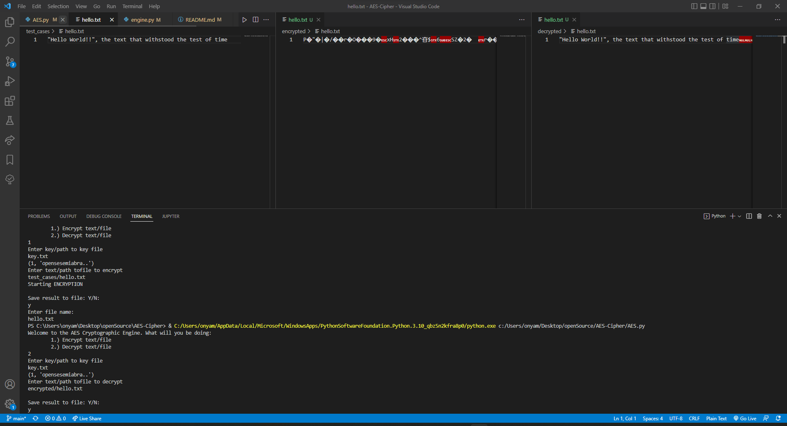

# AES-Cipher
Implimentation of the AES cipher

## Docs
<a href="https://docs.google.com/document/d/1Du-ZQ_tDTA_uFPTC8d6XFwKbP6rXH4i24Gooj7dlTGs/edit">Methodical Material</a>

## Dependencies
None

## Entry Point
Python file <a href="./AES.py">`AES.py`</a>

## Sample Usecase
